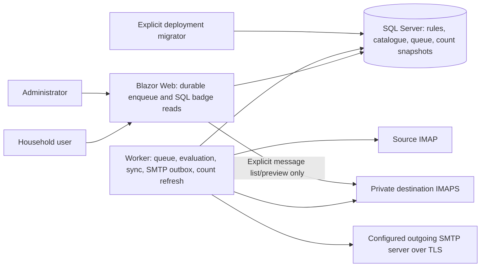
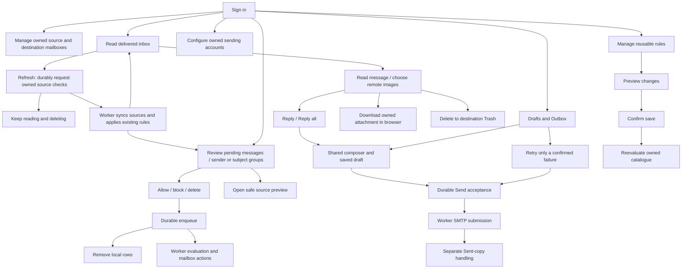
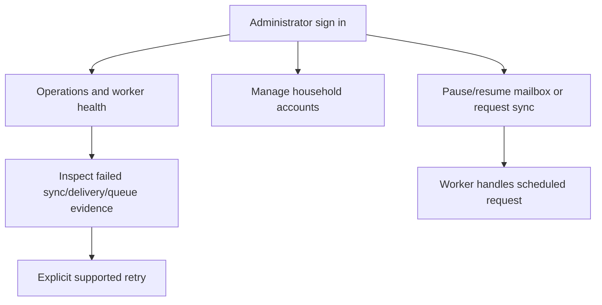

# MailWinnow

Current shipped version: **1.19.2.126**. Version metadata is maintained in `src/MailWinnow.Web/MailWinnow.Web.csproj`; every shipped task increments `BuildNumber` as documented in `VERSIONING.md`.

MailWinnow is a self-hosted email filtering and selective-delivery platform for households.

## Architecture



## Review responsiveness

Sender allow/block commits a durable command, removes the local message rows, then processes the work in **Worker only**. The sidebar reads SQL count projections, not the full mailbox or live IMAP. Each durable command owns one replay-safe evaluation pass with indexed matching, 200-header tracked-state bounds, and renewable owned leases. Destination counts are worker-maintained snapshots; they refresh after a 60-second worker interval plus pass time and the sidebar's 15-second poll. Last successful counts survive IMAP failures.

See [queue performance, freshness, restart behavior, migration, and verification](docs/review-queue-performance.md). Deployment must stop old Web/Worker consumers before activating the new lease-aware worker. The migration adds only nullable destination-count fields; accepted commands and existing mail remain intact.

## Inbox Refresh

**Refresh** now requests new mail from all of the signed-in user's enabled source accounts. The button waits only for the durable SQL request, not source IMAP. The Worker checks for requested syncs every two seconds while idle, then uses existing account locks, incremental synchronization, rule evaluation and delivery. If already busy, it handles the request on a subsequent cycle; two seconds is an idle discovery bound, not a mail-delivery guarantee. Normal scheduled polling remains configured by `MailSync__PollingIntervalSeconds`.

The page stays usable for reading, showing images and deleting while sources sync. A plain-language status explains waiting, checking accounts, processing deliveries, success or failure. Lightweight owner-scoped SQL progress checks occur every three seconds for up to five minutes while the page remains open. Local IMAP headers reload initially, when delivery/cleanup progress changes, and at completion—not on every status check. Leaving the page cancels observation only; accepted work remains durable. After five minutes the page says work is still running rather than falsely reporting completion. If no enabled source accounts exist, Refresh still reloads the local inbox.

Each source pass keeps the existing configured header batch limit (default 100 new messages per selected folder). A completed check is not a guarantee that an arbitrarily large source backlog has drained; remaining headers are handled by later scheduled passes. Approved mail appears in Inbox; mail needing a decision remains in Review, and blocked mail follows the existing Blocked workflow. Refresh does not bypass rules or reset retention deadlines. Removed messages are cleared from the reading pane, and late refresh results cannot reintroduce a message optimistically deleted in that page. Each local list/body read has its own service scope and timeout; source sync never executes in the browser's request/circuit. This feature uses existing source-request fields and adds no database migration.

## Inbox attachment downloads

Open a delivered Inbox message to see its **Attachments** list, then click a filename to download it. Ordinary file attachments and attached emails (`.eml`) are supported; inline-only body images are not listed as files. Downloads use a separate authenticated browser request, not Blazor base64/JavaScript transfer, so the inbox remains usable. There is no bulk download or source-review attachment endpoint in this release.

Each link is bound to the current owner's enabled destination mailbox ID, exact folder, a fingerprint of the IMAP connection identity (not its password), message UID and UIDVALIDITY, and attachment index. Changing the destination account/folder or configured IMAP server, resetting the mailbox or deleting the message invalidates old links. Filenames are reduced to safe basenames. Responses force `Content-Disposition: attachment`, `application/octet-stream`, `nosniff` and private `no-store`; attachments are not rendered or executed by the app. Downloads do not alter messages, rules, read flags or retention deadlines.

The authenticated GET route is `/inbox/attachments/{destinationMailboxId}/{uid}/{uidValidity}/{attachmentIndex}?folder=...&identity=...`. Each request has a 60-second overall limit (the existing IMAP transport has its own 30-second limit) and a **25 MiB decoded-file limit**. Larger files require a mail client. Missing/stale links return404, oversized files413, temporary failures503 and overall timeout504 with a readable explanation. The existing IMAP transport fetches the full MIME message; the decoded-file cap is not a cap on total MIME fetch size. Opening the reader lists filenames from its existing MIME fetch without decoding attachment payloads again; downloading refetches that exact message to verify current mailbox identity. No attachment cache or database migration is introduced.

## Replies, drafts, and outgoing mail

Open a local inbox message and choose **Reply** or **Reply all**. The reusable plain-text composer supports editable To/Cc/Bcc, From, subject, quoted text, and new attachments. Original attachments are not automatically included. Reply respects `Reply-To`; Reply all adds the original To/Cc recipients, removes configured self addresses, and never copies original Bcc. Threading headers are preserved from the original message. A new-message Compose entry point is reserved for a later release.

Configure **Sending accounts** before sending: enter your provider's SMTP host, TLS mode (required STARTTLS or implicit TLS), port, authentication, and explicit From address. Enable the account when ready. When editing an account, the selected TLS mode remains selected and is saved with the account. Source-mailbox associations organize sending accounts, but existing delivery records do not securely bind the historic destination login. Choose From explicitly for replies; the app will not guess from recipient headers or old mailbox UIDs. An IMAP login is not assumed to be a valid SMTP identity. Passwords are entered only in the signed-in application and are never displayed back. Select whether the provider saves Sent copies or Mail Winnow should append a copy to the configured local Sent folder.

Drafts are saved durably with revision checks and can be reopened from **Drafts & Outbox**. Switching inbox messages does not replace an open draft. **Send** commits an immutable outbox entry and returns without waiting for SMTP; only Worker submits mail. Duplicate submission of the same draft cannot create another outbox message. Required recipient/identity validation runs before acceptance. You can upload up to 20 files, at most 25 MiB each and 30 MiB total, within a 45 MiB encoded-message limit.

The outbox distinguishes queued, sending, sent, failed, and **outcome unknown**. “Sent” means the SMTP server accepted the submission, not that every recipient received it. If the connection or worker stops around submission, Mail Winnow does not automatically resend uncertain mail: check the provider before deciding what to do. Safe pre-submission failures can be retried explicitly. Saving a local Sent copy is a separate stage; a failure there never resubmits SMTP. An ambiguous IMAP append is shown as unconfirmed and is not automatically repeated, to avoid duplicate archive copies.

Outbound content is intentionally separate from the inbound header-only catalogue. Draft bodies, attachment bytes, and immutable MIME/settings snapshots are protected using the shared Data Protection key ring. Retain those keys with database backups. Editable drafts remain until discarded. Successfully sent outbox records with a saved Sent copy (or an explicitly configured provider-managed copy) are removed after 30 days, together with their locked draft/upload duplicates. Failed and uncertain outcomes are not automatically removed. Cleanup never deletes mail from the local Sent folder or changes incoming-message retention. Uploads across editable drafts are capped at 200 MiB per owner; discarding an editable draft removes its uploads. Do not include payloads or SMTP credentials in diagnostics.

For the real-browser dialog regression, render `MailboxDialogRenderedTests` with `MAILBOX_DIALOG_FIXTURE_PATH` set to a temporary HTML path, then run `node scripts/check-mailbox-dialogs.mjs /path/to/playwright/index.mjs /path/to/fixture.html`. The script uses installed Chromium (override `CHROMIUM_PATH` if needed) and never opens production mailboxes.

## Mailbox editing dialogs

Source and destination **Edit** forms open as native top-layer dialogs, outside the scrolling table. They remain above other page content, fit small screens with internal scrolling, support Escape/Close, and return focus to the initiating button. Password fields clear on close. The forms retain normal server-rendered POST and antiforgery handling; JavaScript only controls dialog presentation.

## Solution layout

`MailWinnow.sln` is the repository entry point. Source projects live in `src/`; automated tests live in `tests/`.

- `MailWinnow.Web` is the Blazor host and authentication boundary.
- `MailWinnow.Worker` is the independently runnable scheduled IMAP-processing host.
- `MailWinnow.Core` contains dependency-free entities, interfaces, rule logic, and shared models.
- `MailWinnow.Infrastructure` contains implementations for EF Core, MailKit, encryption, and other external services. It may depend on Core, but Core never depends on it.
- `MailWinnow.Tests` contains unit and integration tests. It may reference production projects but is not referenced by them.
- `MailWinnow.DbMigrator` is the one-shot deployment utility that applies EF Core migrations.

The hosts may reference Core and Infrastructure. Infrastructure may reference Core. These references establish the dependency direction and prevent circular dependencies.

## Development conventions

Canonical AI contributor guidance lives in `ai-instructions.md`, with compatibility entry points in `AGENTS.md`, `CLAUDE.md`, and `.github/copilot-instructions.md`. Every behavior change requires appropriate new or updated tests and a full test-suite run.

By default, tasks that change tracked files must publish a verified feature branch and pull request to `clintonfrankland/mail-winnow` on GitHub, verify checks for the current PR head, and hand off for independent review. A local commit alone is not delivery. Clinton must explicitly approve any merge or direct update to `main`; local-only work must also be explicitly requested. See the GitHub Delivery Default in `ai-instructions.md` for the full standing policy and Kanban contract guidance.

Use the .NET 10 SDK and run the solution from the repository root:

```sh
dotnet restore MailWinnow.sln
dotnet build MailWinnow.sln --no-restore
dotnet test MailWinnow.sln --no-build
```

`Directory.Build.props` applies nullable reference types, current analyzers, and warnings-as-errors to every project. The initial EF migration was an empty baseline; later migrations define the current application schema.

## GitHub validation

The GHCR publication workflow skips validation and publishing cleanly when the completed Tests run comes from a pull request, a non-`main` branch, or an unsuccessful test run. Only successful `main` push runs enter validation; the existing canonical-repository and exact-revision safety checks still fail closed for eligible runs. A failed Tests run remains visible as a failure in the Tests workflow itself.

GitHub Actions runs the stable **Tests** check on pull requests to `main` and pushes to `main`. It uses the .NET 10 SDK and the same solution-wide restore, build, and full-test commands shown above. The workflow has read-only repository contents permission and is defined in [`.github/workflows/tests.yml`](.github/workflows/tests.yml).

After a successful **Tests** run that was triggered by a trusted push to the canonical repository's `main` branch, [the GHCR publication workflow](.github/workflows/publish-ghcr.yml) checks out that exact tested 40-character revision and publishes the Web, Worker, and DbMigrator images. The images are `ghcr.io/clintonfrankland/mail-winnow-web`, `ghcr.io/clintonfrankland/mail-winnow-worker`, and `ghcr.io/clintonfrankland/mail-winnow-db-migrator`. Each image has exactly two production tags: the strict `VersionPrefix` (`MAJOR.MINOR.PATCH`) and the full tested SHA; it never publishes `latest`. A future GHCR release must advance `VersionPrefix` for a new semantic tag while keeping `BuildNumber` monotonic for the separate four-part assembly/display version.

Before pushing, the workflow inspects all six expected registry tags and fails closed on malformed versions, semantic-tag collisions, or any partial/conflicting state. It validates the current Buildx flat `image` object only when its `os` and `architecture` are Linux/amd64, while retaining compatibility with Buildx's prior `image["linux/amd64"]` object. A rerun is a no-op only when every expected semantic/SHA tag pair already resolves to the same digest with the expected OCI source, version, and revision labels. For a publication it captures each Buildx-produced manifest digest; for a no-op rerun it retains the complete preflight digest set. The final inspection requires both tags of every component to match those independently captured expected digests. The workflow serializes its own publication runs and rechecks those digests after publishing; this is not an atomic registry immutability guarantee against an unrelated writer, so package write access must remain tightly controlled.

Blazor query-string filters must bind only framework-supported scalar types. For enum filters, bind the raw query value as `string`, parse it explicitly with `Enum.TryParse`, and treat missing or invalid values as an unfiltered request. Keep regression coverage for missing, valid, case-insensitive, and invalid values so a filter cannot prevent its page from rendering.

HTML checkboxes are omitted from form submissions when unchecked. Login form request models must therefore use a property-bound model with `RememberMe` defaulting to `false`; do not make the checkbox a required constructor-bound value. Run `scripts/smoke-login-form.sh <base-url>` after deployment to verify that both unchecked and checked submissions reach the login handler without an HTTP 400 response. The smoke test deliberately uses invalid credentials and never accepts a password argument.

Mailbox forms follow the same property-binding rule. New source-account submissions omit `Id`, unchecked TLS/enabled/discovery fields are absent, and selecting no folders omits `SelectedFolders`. Keep these request models parameterless with safe property defaults so omitted optional fields reach the handler instead of failing model binding. Run `scripts/check-mailbox-form-contract.sh` before deployment; it verifies both the rendered form shape and the property-bound request contract.

The Mailboxes page presents any number of source accounts as a compact list with a single **Add source** action. Each household user has one destination mailbox, shown separately as a non-secret summary of username, configured host, port, transport security, folder, enabled state, and whether a credential is stored. Never render, return, or prefill the protected destination credential; password fields are blank and accept only a replacement value.

The Web UI uses one shared visual system across authenticated, authentication, administration, mailbox, review, error, and empty states. The transparent PNG Mail Winnow envelope mark is the canonical product identity and appears directly, without clipping or a decorative tile, in the application navigation, authentication flows, browser favicon, and mobile home-screen icon. New pages must use the common application shell, page headings, cards, forms, status badges, and responsive breakpoints rather than browser-default controls or template content. Keep keyboard focus visible on interactive elements, respect reduced-motion preferences, and preserve readable mobile layouts. Run `scripts/check-ui-contract.sh` with the focused UI tests before deployment.

## Application migrations

The application uses EF Core with SQL Server. `MailWinnowDbContext` reads the standard `ConnectionStrings:MailWinnow` configuration value, supplied in deployed environments through the scoped `ConnectionStrings__MailWinnow` variable. No host applies migrations during normal startup.

After database provisioning, run the one-shot migrator separately in each isolated environment:

```sh
ConnectionStrings__MailWinnow='<application connection>' \
dotnet run --project tools/MailWinnow.DbMigrator
```

The migrator applies pending migrations, reports failures with a non-zero exit code, and is safe to run again. Verify the resulting `__EFMigrationsHistory` entry before continuing from development to production.

## SQL Server provisioning

Server-level provisioning is intentionally separate from application migrations. The credential-free `tools/MailWinnow.SqlProvisioner` utility idempotently creates or reconciles one database, its dedicated SQL login and user, and the database-local `db_owner` role needed by the controlled EF Core migration process. It removes fixed server-role membership and denies database enumeration; it does not create application tables or run EF Core migrations.

Supply all inputs at runtime through environment variables:

```sh
MAILWINNOW_SQL_ADMIN_CONNECTION='<administrator connection>' \
MAILWINNOW_SQL_DATABASE='MailWinnow_Dev' \
MAILWINNOW_SQL_LOGIN='mailwinnow_dev' \
MAILWINNOW_SQL_PASSWORD='<strong generated password>' \
dotnet run --project tools/MailWinnow.SqlProvisioner
```

Use separate passwords for production and development. Store the resulting application connection strings only in Home Helm as secret `ConnectionStrings__MailWinnow` variables scoped to `Production` and `Review`; never commit them or deployed `.env` files.

## Credential protection

Mailbox passwords, app passwords, destination passwords, SMTP passwords, and future OAuth refresh tokens must be stored only through `ICredentialProtectionService`. The abstraction uses purpose-separated ASP.NET Core Data Protection payloads and never exposes a read/display model. A missing key-ring configuration or mount fails host startup, while corrupt payloads and unavailable keys raise a safe `CredentialProtectionException` without including plaintext.

Both Web and Worker read `DataProtection:KeysPath` (`DataProtection__KeysPath` as an environment variable) and use the fixed `MailWinnow` application discriminator. In containers, the deployment Compose configuration mounts the same named volume into both services. Back up this volume with the database: losing its key files makes saved credentials intentionally undecryptable.

## Destination IMAPS service

[`deploy/dovecot`](deploy/dovecot/README.md) contains a standalone Dovecot IMAPS Compose template for household destination mailboxes. It deliberately excludes SMTP and Postfix; use it only as the local IMAP target for approved messages. The template documents password-file users, TLS, persistence, backups, and its disposable smoke test.

## Home Helm container deployment

[`deploy/docker-compose.home-helm.yml`](deploy/docker-compose.home-helm.yml) builds separate Web and Worker images plus a profile-gated one-shot migrator. All three run as the .NET image's non-root application user. Web listens on container port 8080 and exposes an anonymous `GET /healthz` check that returns 200 only when its scoped database is reachable. Worker writes its heartbeat to the shared database; administrators can observe it on the Web Operations page. Application logs go to stdout/stderr. Do not log configuration dumps, connection strings, credentials, or message bodies.

Home Helm must maintain separate managed runtime env files for Production and Review. In each scope, set `ConnectionStrings__MailWinnow` to that scope's database and never copy one managed env file over the other. Compose requires the variable and passes it through the shared environment block to both Web and Worker. Use distinct Compose project names and named volumes per environment so Review cannot share Production's database or Data Protection keys.

The complete non-secret contract is in [`deploy/mailwinnow.env.example`](deploy/mailwinnow.env.example). Production must retain these values:

```text
LocalImap__Host=mailwinnow-imap.clintandtara.com
LocalImap__Port=993
LocalImap__UseSsl=true
LocalImap__AllowInvalidCertificate=false
```

`MailSync__PollingIntervalSeconds`, `MailSync__BatchSize`, and `MailSync__MaximumConcurrency` control Worker scheduling. Destination mailbox passwords are stored per household user through the application's encrypted credential store. They do not belong in the shared runtime env file. Delivery uses IMAP APPEND and becomes a move only after the append has a durable destination UID: Mail Winnow then deletes and UID-expunges that exact source UID under the cataloged UIDVALIDITY. A source-deletion failure is retryable without appending another destination copy. This deployment adds no SMTP service.

Allow rules default to keeping the moved destination message forever. The review UI also offers destination retention of 30 days (shown as 1 month), 7 days, 3 days, or 1 day. One-message approvals use the Forever default. Retention never authorizes deleting the source before the destination append is confirmed.

Authenticated users manage reusable allow/block rules on `/rules`. The page supports creating, editing, and removing rules, including action, match type/value, and destination retention. Message Review links to this page instead of duplicating the rule-management interface.

Creating or editing a rule is a two-step workflow. The first submission previews the unchanged proposal against the signed-in user's currently Pending, cataloged headers without saving a rule or queueing, moving, or deleting messages. The preview honors user or source-mailbox scope, temporary-rule timing, existing-rule precedence, and edit replacement semantics. It reports Allow and Block impact counts and shows at most five deterministic newest-first samples containing sender and subject only. Message bodies are never fetched or included. Saving requires explicit confirmation; changing action, match settings, scope, mailbox, temporary duration, or retention invalidates the protected preview. Expired, altered, cross-user, and replayed create confirmations cannot create another rule or trigger reevaluation again.

Block rules support exact sender addresses and sender domains. Both rule types parse a valid, single-mailbox `From` header and use its mailbox address; missing, malformed, ambiguous, or incomplete addresses are rejected without a match. Synchronization still catalogs RFC headers for every discovered message in selected source folders. The Worker moves messages whose final outcome is Block into the user's destination `Blocked` folder, creating it when needed, before deleting and UID-expunging the exact source UID under the cataloged UIDVALIDITY. A durable destination receipt prevents a source-deletion retry from appending a second copy. Message Review exposes Block sender and Block domain actions in Recent, By sender, and By subject views.

Message Review - Recent lets a user open a pending message's read-only preview in place. Message Review - Sender first expands a compact sender group into newest-first message rows, then lets the user open each selected message independently without losing the group decision controls. Bodies are fetched only when that individual preview is opened; merely loading a review page or expanding a sender group never fetches message bodies. Previews display safe message headers and sanitized HTML, or formatting-preserved plain text when HTML is unavailable. The server verifies that the pending item and its source mailbox belong to the signed-in user before using the cataloged mailbox, folder, UID, and UIDVALIDITY to read it. For privacy, remote images and all other remote content are permanently blocked in every Review preview; there is no **Show images** control. Safe embedded CID images may render subject to the reader's existing MIME and size restrictions. Previewing is informational only and never changes a pending review decision, delivery state, counts, or reusable rules.

Deleting a message from Mail Winnow's destination Inbox moves it into a destination `Trash` folder, creating that folder when needed. Once per hour the Worker permanently deletes messages whose IMAP internal date is older than 14 days from `Blocked` and older than 30 days from `Trash`; missing managed folders are created during that pass. The authenticated navigation is available immediately, while inbox and review badges load independently in the background and remain hidden when their count is zero or unavailable.

Build and start an environment from its Home Helm-managed env file without printing its contents:

```sh
docker compose --project-name mailwinnow-production \
  --env-file /path/to/home-helm/production.env \
  -f deploy/docker-compose.home-helm.yml up -d --build web worker
```

Run migrations only as an explicit, fail-fast one-shot operation before normal startup or during an approved deployment:

```sh
docker compose --project-name mailwinnow-production \
  --env-file /path/to/home-helm/production.env \
  -f deploy/docker-compose.home-helm.yml --profile migration run --rm migrate
```

For each environment, verify from both actual application containers that DNS resolves and the public TLS chain validates. `openssl s_client` must exit successfully without `-verify_none`; install/use an ephemeral diagnostic container in the same Compose network if the minimal runtime image lacks these tools. Then request `/healthz` and confirm the Operations page shows a current Worker heartbeat. Confirm database identity using a non-secret database name query from each container network, and compare it with the expected scoped database. Never print the connection variable itself in deployment output.

The credential-safe `MailWinnow.DeploymentProbe` performs those database, DNS, TCP, and strict TLS checks using the actual container environment. Publish it, copy the output directory into each running Web and Worker container, and execute `dotnet MailWinnow.DeploymentProbe.dll` there. Its JSON output contains only the database name, connectivity booleans, heartbeat freshness, TLS protocol, and the invalid-certificate-bypass state. It never emits the connection string or mailbox credentials.


## Technologies and dependencies

| Technology | Version | Role |
|---|---|---|
| .NET / ASP.NET Core / Blazor | 10.0 | Web, worker, and tooling runtime |
| Entity Framework Core | 10.0.10 | SQL Server persistence and explicit migrations |
| SQL Server | Runtime supplied by Home Helm | Durable catalogue, queues, snapshots and identity |
| MailKit / MimeKit | MailKit 4.17.0 (resolved MIME dependency) | IMAP connection, fetching, delivery, SMTP submission and MIME parsing |
| Docker Compose / nginx | Host runtime / nginx 1.29 | Separate Web/Worker services and existing health-checked route cutover |
| xUnit / bUnit | 2.9.3 / 2.9.0 | Unit, SQL-fixture and rendered UI regressions |
| Playwright / Chromium (optional browser regression) | Playwright 1.63.0 / installed Chromium | Local rendered mailbox-dialog fixture; not a production dependency |

Exact per-project package versions, project references, and the source file inventory are in [source and dependency reference](docs/source-reference.md).

## Domain and SQL objects

| Table/domain concept | Purpose |
|---|---|
| `SourceMailboxes` | Owner-bound upstream IMAP account and sync state |
| `SourceMailboxFolderSyncStates` | Folder UIDVALIDITY/checkpoints for incremental catalogue sync |
| `SourceMessageHeaders` | Header-only catalogue with persisted evaluation/deletion state |
| `DestinationMailboxes` | Private local mailbox and last worker-observed inbox count/timestamp |
| `MailRules` | Reusable source/user-scoped allow/block rules, time windows and retention |
| `MessageDecisions` | Explicit per-message approve/delete/pending overrides |
| `ReviewDecisionWorkItems` | Durable decisions, active idempotency key, retry/lease/completion evidence |
| `MessageDeliveries` | Destination append and source-deletion idempotency/retention receipts |
| `SendingAccounts` | Owner-scoped From/source mapping, protected SMTP credentials and Sent-copy policy |
| `MessageDrafts` | Protected editable reply content, optimistic revision and queued outbox identity |
| `DraftAttachments` | Bounded protected uploads attached to an owned draft |
| `OutgoingMessages` | Immutable protected MIME/settings, durable SMTP state and fenced worker lease |
| `AuditEvents` | Metadata-only administrative/rule/decision audit trail |
| `WorkerHeartbeats` | Worker liveness and scheduling observations |
| Identity tables (`AspNetUsers`, roles, claims, logins, tokens, user roles) | Household authentication and authorization |
| `__EFMigrationsHistory` | Explicit application-schema migration history |

The EF model and migration history are authoritative for exact names and fields. No application views or stored procedures are added by this repair.

## User workflows





## Constraints and pitfalls

- Preserve owner boundaries, protected credentials, durable accepted commands and mailbox UIDVALIDITY/idempotency checks. Do not introduce an in-memory-only decision queue.
- Keep reusable logic in Core/Infrastructure, async data access and the existing UI system. Fresh read scopes and bounded tracked state must not be replaced with circuit-long catalogue contexts.
- Apply new schema through additive EF migrations during explicit deployment, never normal host startup. Keep runtime configuration and secrets out of source and logs.
- Review badges use eventually consistent worker projections; they do not promise instant visibility of external IMAP changes. Actual Inbox remains a live read.
- Old and new queue consumers must not overlap during this lease-semantics upgrade. Preserve old images for rollback and use the current Home Helm production Compose/cutover paths.
- Passing a process launch or a short tool wait is not test completion. Collect terminal build/test output and verify installed identity and health before reporting deployment complete.
