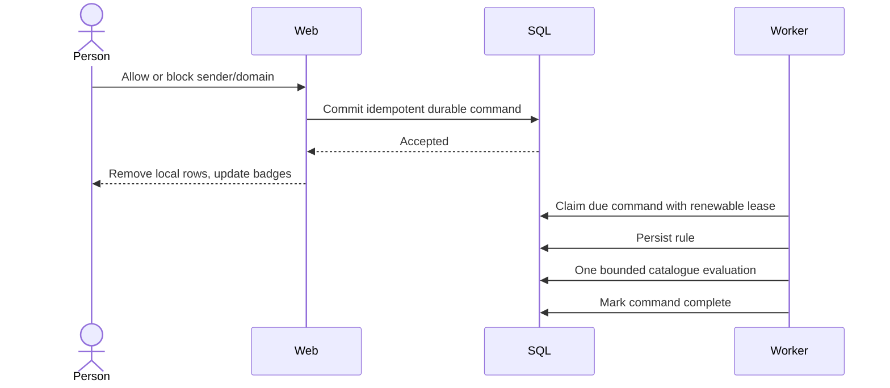

# Review queue and navigation performance

## Interactive contract

The browser never waits for rule evaluation, delivery, or IMAP to acknowledge a decision. It waits for durable queue insertion, then removes the selected local rows. If insertion fails, the rows remain with an error. Queued message IDs are excluded from review projections so polling/navigation does not resurrect accepted decisions. Completion time and click acknowledgment time are separate metrics.

## Queue ownership and retry

Only `MailWinnow.Worker` hosts `ReviewDecisionQueue`. Web retains its durable enqueue/metrics service but never starts its processing loop. Idle delay backs off from 250 ms to a maximum of 2 seconds and resets after work. With a healthy idle worker and database, work is discovered within that maximum polling delay, plus database/scheduling time. A busy worker processes commands serially; a large backlog is not promised a two-second completion time.

Due-work selection filters and orders in SQL and returns at most 16 IDs, rather than loading the entire backlog. While Processing, `NextAttemptUtc` is the renewable lease deadline. `StartedUtc` records the actual start, and `AttemptCount` fences the generation. A heartbeat renews every 20 seconds with a two-minute lease. Reclaim, completion, and retries use conditional updates; an old attempt cannot acknowledge or reschedule a newer owner. Loss of renewal cancels processing. Shutdown awaits the renewal loop, leaving unfinished work recoverable after lease expiry. Retry failures remain observable and retain the existing three-attempt terminal-failure behavior.

Rule persistence does not trigger evaluation for queue callers. Each attempt explicitly runs exactly one required evaluation pass and records phase logs with work ID and attempt number. A crash after rule persistence replays one idempotent pass even if the rule is already identical. A crash after evaluation but before the completion receipt may repeat the pass; this is intentional at-least-once recovery, not duplicate work during normal processing. It never blindly skips an incomplete catalogue.

## Evaluation costs

The existing canonical rule evaluator retains authority over ownership, source scope, effective/expiry times, per-message decisions, block/allow precedence, deterministic tie-breaking, and conflict explanations. A compiled rule set indexes normalized sender/domain/exact-subject match keys once per pass. Every message is still checked against the applicable candidates, including subject-contains rules.

Full reevaluation uses 200-header pages. Saved headers, page delivery records, and immutable audit records are detached so tracked state does not grow with the catalogue. Unchanged outcomes retain their evaluation timestamp. Existing deliveries are queried once per page and are not requeued or saved again; new eligible deliveries preserve the normal ownership, retention, and durable delivery rules. Replaying a completed pass does not append another mailbox copy.

The representative regression covers **4,456 headers and 751 rules**, more than the related task's 1,300-header requirement. It asserts canonical-equivalent outcomes, a maximum of 200 tracked headers, preservation of the caller's work item, no writes through the delivery service for already queued deliveries, and a 20-second upper bound on the evaluation pass in the local SQLite fixture. This is a regression bound, not a production latency SLA. SQL Server and live queue metrics are checked at deployment separately.

## Sidebar projections and freshness

The sidebar refreshes scalar, owner-scoped SQL counts every 15 seconds. It does not load headers/rules into the Blazor circuit or open an IMAP connection. Review message/sender counts use persisted evaluation outcomes and exclude active queued IDs. Review pages retain current-rule evaluation on explicit page load using a fresh, short-lived read scope; they do not retain a circuit-long EF tracker.

The worker observes enabled destination INBOX folders once per refresh pass and stores `InboxMessageCount` and `InboxCountObservedUtc`. This includes externally added/deleted messages, unlike counting only Mail Winnow deliveries. Each IMAP observation has a 15-second limit. The worker waits 60 seconds between passes; freshness is that interval plus pass duration and the sidebar's next refresh. Null means no successful observation yet; zero/unavailable badges remain hidden. Failures preserve the last good snapshot. Changing destination identity invalidates it, and in-flight observations cannot overwrite a changed destination.

Temporary-rule owners are reevaluated once at worker startup and when an effective/expiry boundary changes. Successful boundaries are acknowledged in worker memory, not repeated every poll; failures retry. Count freshness is eventual while worker processing is underway. Local count updates still remove a newly accepted decision immediately.

## Deployment and rollback

`AddNavigationCountSnapshots` is an additive EF migration adding two nullable destination columns. Run the one-shot migrator explicitly during deployment; ordinary Web/Worker startup must not apply migrations. No existing data is removed or reset.

Build and validate first. Then stop **both old Web and old Worker** before starting the new worker: previous binaries can reclaim healthy work without honoring renewable leases. Preserve accepted queue rows and allow expired unfinished work to resume. Use the existing candidate route/health checks, then promote. Avoid overlapping candidate and primary workers during promotion. Keep the previous images and database backup; the additive schema remains readable by the old release if application rollback is necessary. Do not revert the migration by dropping populated snapshot columns during an operational rollback.

Production checks: deployed version/image identity, routed/direct health, current worker heartbeat, successful snapshot timestamp, bounded queue processing, and no competing Web queue host. Never send synthetic decisions against real user messages to test performance.

## Files

| File | Responsibility |
|---|---|
| `Core/Rules/RuleEvaluator.cs` | Canonical precedence and indexed reusable match keys |
| `Infrastructure/Rules/ReviewDecisionQueue.cs` | Durable acceptance, leases, bounded selection, one evaluation per attempt |
| `Infrastructure/Rules/RuleEvaluationService.cs` | Owner-bound bounded evaluation and separate rule persistence |
| `Infrastructure/Mailboxes/MessageDeliveryService.cs` | Durable delivery and no-op avoidance |
| `Infrastructure/Rules/NavigationCountService.cs` | SQL sidebar projections and queued-message exclusion |
| `Infrastructure/Rules/NavigationProjectionRefreshWorker.cs` | Worker destination snapshots and temporal-rule refresh |
| `Infrastructure/Rules/ScopedMessageReviewService.cs` | Fresh-scope review reads outside circuit lifetime |
| `Infrastructure/Persistence/Migrations/*AddNavigationCountSnapshots*` | Additive snapshot columns |
| `Web/Components/Layout/NavMenu.razor` | Async snapshot/count display and local revision handling |
| `tests/MailWinnow.Tests/Rules/RuleEvaluationPerformanceTests.cs` | Large-catalogue and canonical equivalence regressions |
| `tests/MailWinnow.Tests/Rules/ReviewDecisionQueueTests.cs` | Acknowledgment, replay, lease/claim, failure, bounded selection |
| `tests/MailWinnow.Tests/Review/Navigation*Tests.cs` | Ownership, count query shape, freshness, failure, rendering |
